# Atlas Exam Studio Workflow

## Current verified flow

1. Sign in as faculty or admin.
2. Create or select a subject.
3. Open **Materials**.
4. Select a PDF, DOCX, PPTX, or TXT file.
5. Click **Upload and process**.
6. The backend validates and stores the file.
7. Text is extracted and split into document chunks.
8. The chunks are indexed for retrieval.
9. Open **Patterns** and create a paper blueprint, such as 10 MCQs + 5 short answers +
   2 long answers. The total marks must equal the sum of every section.
10. Open **Generate**, select the saved paper pattern, choose difficulty and Bloom learning
    objective, then enter the chapter/topic to generate a complete grounded paper.
11. Save useful candidates as drafts.
12. Open **Question bank** and approve or reject drafts.
13. Select approved questions and create a question bank.
14. Open **Model papers** to assemble and publish a final paper from the approved bank.
15. Students open **Practice**, answer questions, submit, and view explanations.

## Completed milestones

- Retrieval readiness: indexing is shown separately, embeddings are persisted,
  indexed counts and embedding models are reported, and generation explains
  when indexed source chunks are unavailable.
- Analytics: student performance, difficulty summaries, and weak-topic
  identification are available through the API and Analytics workspace.
- Research evaluation: a deterministic benchmark fixture and repeatable
  evaluation command report coverage, diversity, distributions, and duplicate
  metrics.
- Security and integration: practice ownership boundaries, protected endpoint
  error contracts, and the start-submit-result flow are covered by tests.
- Documentation and deployment: API guidance, environment configuration,
  Docker Compose, container exclusions, and CI validation are documented.

## Next milestone

The next milestone is institution-specific production hardening: select and
configure the managed MongoDB/vector infrastructure, real embedding and LLM
providers, frontend hosting, ingress/TLS, observability, backup/restore, and
an approved deployment policy.

## Provider configuration

Question generation uses the configured provider:

```env
LLM_PROVIDER=deterministic
```

For NVIDIA NIM with Kimi K3:

```env
LLM_PROVIDER=nvidia
NVIDIA_MODEL=moonshotai/kimi-k3
NVIDIA_API_KEY=replace-with-your-nvidia-key
```

Hosted providers require their own API credentials. Never commit provider keys to source control.

## Local verification

```powershell
Set-Location backend
..\.venv\Scripts\python.exe -m pytest -q

Set-Location ..\frontend
npm test -- --watch=false
npm run build
```

## Verified website walkthrough

The isolated demo walkthrough was completed on `http://localhost:4201` using
the existing `Module 2.pdf` material and the `GIS Multiple Choice` template.

```mermaid
flowchart LR
    A[Select GIS2025 subject] --> B[Choose Module 2.pdf]
    B --> C[Upload and process]
    C --> D[Extract text]
    D --> E[Create 82 chunks]
    E --> F[Index with hash-embedding-v1]
    F --> G[Generate grounded candidate]
    G --> H[Save as draft]
    H --> I[Faculty approves question]
    I --> J[Create and approve GIS question bank]
    J --> K[Create GIS demo model paper]
    K --> L[Publish model paper]
```



Observed UI checkpoints:

1. Materials showed `Processing complete`, `100%`, and `82 chunk(s) indexed`.
2. Generate showed one deterministic candidate marked `Human review required`.
3. Question bank showed the draft and the `Approve` action.
4. Approved content showed the question selected for bank creation.
5. Model paper creation and publication completed through the API-backed workflow.

The hosted OpenRouter provider remains optional; the deterministic provider is
used by the isolated demo to keep the walkthrough repeatable.

## Phase 15: documentation and deployment completion

The repository's deployment completion is intentionally a portable scaffold:

- `backend/Dockerfile` builds the FastAPI service.
- `docker-compose.yml` starts the backend and MongoDB and reads secrets from
  `.env`; it does not embed a usable production secret.
- `.github/workflows/ci.yml` validates the backend and frontend on pushes and
  pull requests.
- `.dockerignore` keeps local environments, build output, and `.env` out of
  the backend image.
- `docs/04-API-CONTRACTS.md` is the concise endpoint inventory; FastAPI's
  generated `/docs` and `/redoc` remain the authoritative request/response
  schemas.

No cloud provider, ingress controller, managed vector database, or production
frontend hosting service is assumed. Select those components according to the
institution's deployment policy and set the environment values described in
the README before exposing the service.
